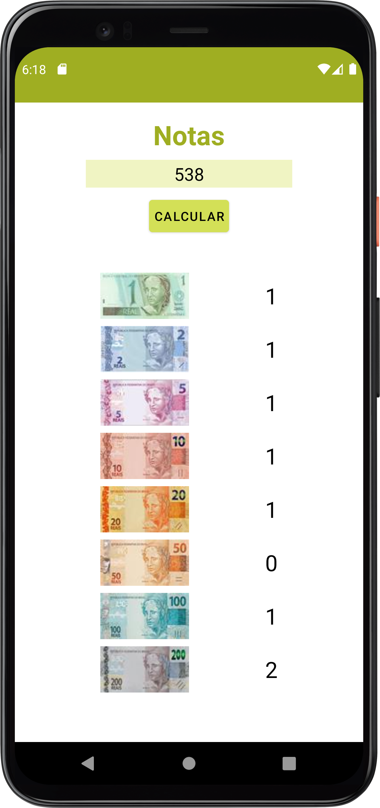

<h1 align="center">Contagem de Notas</h1>
<h2 align="center">Android</h2>

    

<h3 align="center">I. Sobre</h3>

<h4 align="center">Demonstração de uso de Kotlin e Android com código organizado e uso de ferramentas que auxiliam no desenvolvimento.</h4>

<h3 align="center">II. Layout do Projeto</h3>

    

<h3 align="center">III. Tecnologias Utilizadas</h3>

    
Android Studio

    
Kotlin

    
Binding View

<h3 align="center">IV. Autor</h3>
<h4 align="center">Katarine Albuquerque</h4>
<h5 align="center"><i>Linkedin:</i> <a href="https://www.linkedin.com/in/katarine-albuquerque/">/ katarine-albuquerque</a></h5>
<h5 align="center"><i>GitHub:</i> <a href="https://github.com/KatarineAlbuquerque">/ KatarineAlbuquerque</a></h5>

<h5 align="center"><i>Portfólio GitHub:</i> <a href="https://github.com/KatarineAlbuquerque/my-portfolio">/ my-portfolio</a></h5>
